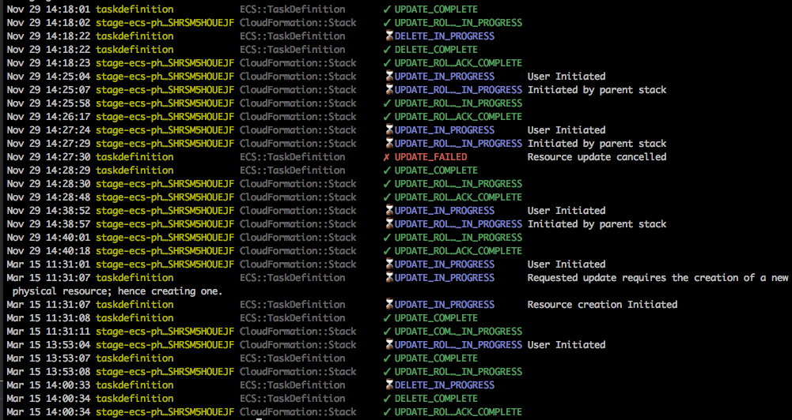

# tail-stack-events

[](https://www.npmjs.com/package/tail-stack-events)

This is a convenient little CLI script (written in Node) to tail
the latest AWS CloudFormation stack events. The UI in the AWS
console kind of sucks for getting a bearing on the status of
a stack that is being updated/deleted/created, so this eases
that pain. Or something.

This script has no dependencies, except `@aws-sdk/client-cloudformation` as a peer dependency.

Use 1.x versions for legacy `aws-sdk` support.

## Sample Output


## Installation
Install using NPM: `npm install tail-stack-events`

Install globally if you're into that and like shoving random things
onto your PATH: `npm install -g tail-stack-events`

## Usage
If installed locally, the path will be `node_modules/.bin/tail-stack-events`.

```
CloudFormation event tailer

Usage: tail-stack-events.js [options...]

--help-h               Show this message
--stack-name, -s name  Name of the stack
--die                  Kill the tail when a stack completion event occurs
--follow, -f           Like "tail -f", poll forever (ignored if --die is present)
--number, -n num       Number of messages to display (max 100, defaults to 10)
--outputs              Print out the stack outputs after tailing is complete
--region region        The AWS region the stack is in (defaults to us-east-1)

Credentials:
  This will do the default AWS stuff. Set AWS_PROFILE environment variable to
  use a different profile, or update ~/.aws/credentials, or whatever the AWS
  docs say to do.

Examples:

  Print five previous events and successive events until stack update is complete:
    tail-stack-events -f --die -n 5 -s my-stack

  Print last 20 events for a stack in us-west-2 region
    tail-stack-events -n 20 -s my-stack --region us-west-2
```
